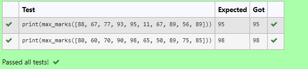
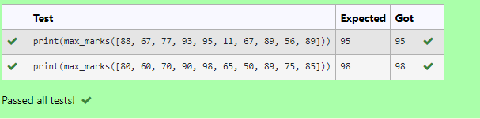
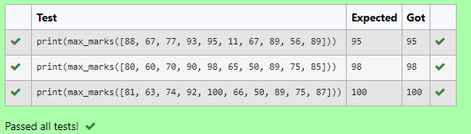

# Find the maximum of a list of numbers
## Aim:
To write a program to find the maximum of a list of numbers.
## Equipment’s required:
1.	Hardware – PCs
2.	Anaconda – Python 3.7 Installation / Moodle-Code Runner
## Algorithm:

### Step 1:
Start Program

### Step 2:
Get the list of marks as input

### Step 3:
Use the sort() function or max() function or use the for loop to find the maximum mark.

### Step 4:
Return the maximum value

### Step 5:
End Program

## Program:
~~~

i)	 To find the maximum of marks using the list method sort.

Developed by: Sarankumar J
RegisterNumber: 21500780

def max_marks(marks):
    marks.sort()
    largest_value=marks[-1]
    return largest_value
    

ii)	 To find the maximum marks using the list method max().
 
Developed by: Sarankumar J
RegisterNumber: 21500780

def max_marks(marks):
    a=max(marks)
    return a
    

iii)  To find the maximum marks without using builtin functions.

Developed by: Sarankumar J
RegisterNumber: 21500780

def max_marks(list1):
    max_mark=0
    for i in list1:
        if i>max_mark:
            max_mark=i
    return max_mark
                
~~~

## Output:

## Result:
Thus the program to find the maximum of given numbers from the list is written and verified using python programming.
